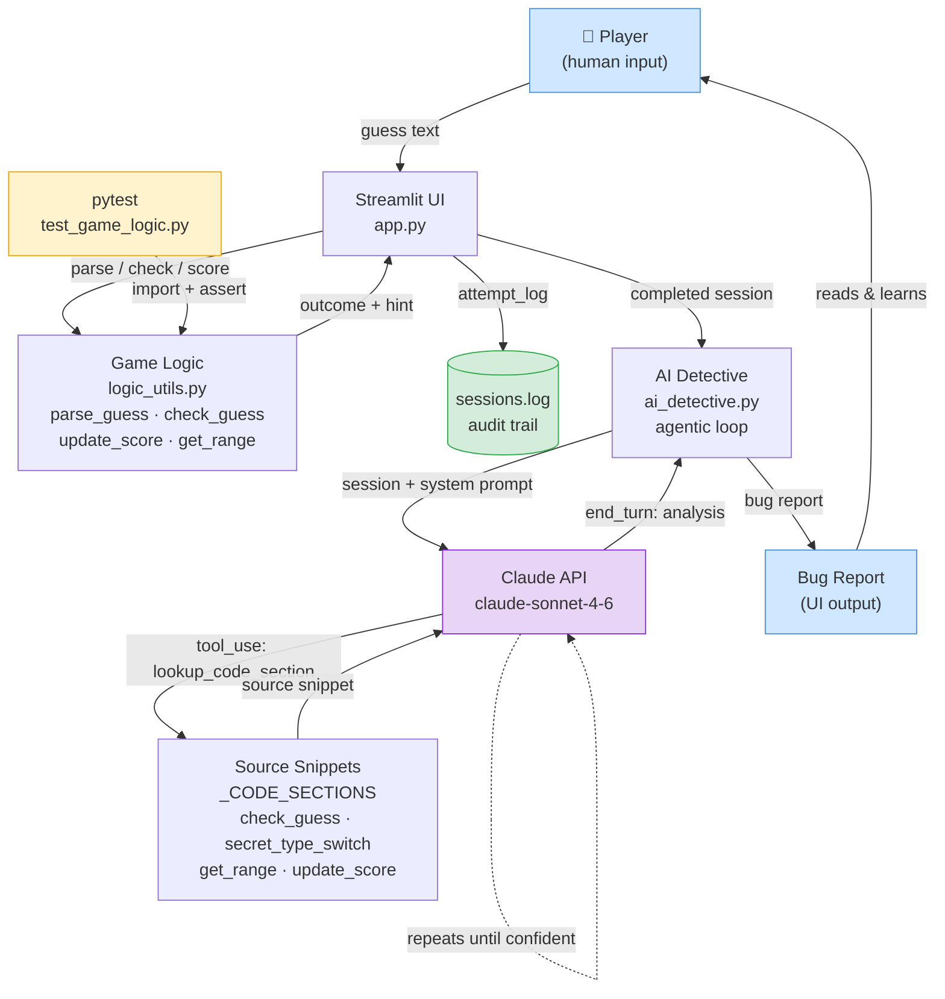

# 🎮 Game Glitch Investigator — AI Bug Detective

> A deliberately broken number-guessing game where an AI agent investigates
> your session, inspects the source code, and explains exactly which bugs
> you hit and why.

---

## Demo Walkthrough

<!-- Replace the line below with your Loom link once recorded -->
**Video:** `[Add your Loom walkthrough link here — record a 2-3 min screen capture showing a full game + AI analysis]`

**What to show in your recording:**
1. Start a Normal-difficulty game and make several wrong guesses (include an even-numbered attempt to trigger type confusion).
2. Lose or win the game, then click **"Analyse My Session"**.
3. Walk through the detective's report on screen, pointing out the bug it found and the code section it inspected.

See the [Sample Interactions](#sample-interactions) section below for written examples of AI inputs and outputs.

---

## Model Card

Full documentation of AI collaboration, known limitations, biases, misuse risks,
and testing results is in [model_card.md](model_card.md).

---

## Original Project 

**Project name:** Game Glitch Investigator — The Impossible Guesser

In Modules 1–3 the project was a Streamlit number-guessing game that was
intentionally shipped with several bugs: hints that pointed the player in the
wrong direction, a secret number that changed type on every other guess, and a
scoring system that occasionally rewarded wrong answers. The original goal was
to practice reading unfamiliar code, identifying bugs through manual play and
`pytest`, and refactoring logic out of `app.py` into a testable `logic_utils.py`
module. By the end of Module 3 the game ran correctly and all tests passed, but
the bug-detection process was entirely manual.

---

## Title and Summary

**Game Glitch Investigator — AI Bug Detective** extends the original project
with an agentic AI layer: after you finish a game (win or lose), you can ask
Claude to analyse your session. The agent reads your guess history, uses tool
calls to inspect the actual source code, and files a plain-language report
explaining which bugs fired during your playthrough and why.

This matters because it demonstrates a realistic use of AI in software
development — not just "ask the model a question", but building a system where
the model gathers evidence, reasons over multiple sources, and produces a
structured, verifiable output. The detective's findings can be checked against
the real code, making the AI accountable.

---

## System Diagram



## Architecture Overview

The system has three layers:

**1. Game layer** (`app.py` + `logic_utils.py`)
The Streamlit UI handles player input and game state. All pure logic — parsing
guesses, evaluating outcomes, updating scores, mapping difficulty to ranges —
lives in `logic_utils.py` so it can be imported and tested independently of
the UI. The intentional bugs are preserved here; exposing them is the point.

**2. Agentic layer** (`ai_detective.py`)
When a game ends the player can trigger an investigation. `run_detective()`
opens a `while True` loop with the Claude API. The agent is given one tool:
`lookup_code_section`, which returns named snippets of the buggy source code.
Claude calls that tool as many times as it needs — once per suspected bug — and
only issues `end_turn` when it has enough evidence to write its report. The loop
exits and the report is shown in the UI.

**3. Reliability layer** (`tests/test_game_logic.py` + `sessions.log`)
`pytest` imports `logic_utils` directly and asserts that `check_guess` returns
the correct outcome tuple. Every completed session — including the AI's analysis
— is appended to `sessions.log` as a structured JSON line, creating an audit
trail a human reviewer can check.

---

## Setup Instructions

### Prerequisites
- Python 3.9 or higher
- An Anthropic API key ([get one here](https://console.anthropic.com/))

### Steps

**1. Clone the repository**
```bash
git clone <your-repo-url>
cd applied-ai-system-final
```

**2. Install dependencies**
```bash
pip install -r requirements.txt
```

**3. Add your API key**

Create a `.env` file in the project root:
```
ANTHROPIC_API_KEY=sk-ant-...
```

The app loads this automatically with `python-dotenv`. Alternatively, export
it in your shell:
```bash
export ANTHROPIC_API_KEY=sk-ant-...
```

**4. Run the app**
```bash
python -m streamlit run app.py
```
The app opens at `http://localhost:8501`.

**5. Run the tests**
```bash
pytest tests/ -v
```
Expected output: 3 tests pass.

---

## Sample Interactions

### Example 1 — Hint reversal bug

**Session:** Normal difficulty, secret = 37. Player guesses 60, receives hint
"📈 Go HIGHER!" and guesses even higher next turn, moving further from the answer.

**Detective input (session JSON):**
```json
{
  "difficulty": "Normal",
  "secret": 37,
  "final_result": "lost",
  "attempts": [
    {"attempt": 1, "guess": 60, "outcome": "Too High", "hint_shown": "📈 Go HIGHER!", "secret_type_used": "integer"},
    {"attempt": 2, "guess": 75, "outcome": "Too High", "hint_shown": "📈 Go HIGHER!", "secret_type_used": "string"}
  ]
}
```

**Detective output (abridged):**
> **Bug 1 — Hint Reversal (Attempt 1)**
> After inspecting `check_guess`, I can confirm: when your guess (60) is greater
> than the secret (37), the code returns outcome `"Too High"` — which is correct
> — but pairs it with the message `"📈 Go HIGHER!"`, which tells you to guess a
> *larger* number. That is the opposite of what you should do. The emoji and
> direction string are both backwards for both branches of the condition.
>
> **Bug 2 — Type Confusion (Attempt 2)**
> On your second attempt (even-numbered), the app converted the secret to the
> string `"37"` before comparison. Your guess `75` triggered a `TypeError` when
> compared to `"37"`, so the code fell into its string-comparison fallback:
> `"75" > "37"` is `True` (because `"7" > "3"` lexicographically), returning
> `"Too High"` — which happens to be correct here, but for the wrong reason.
> Guesses like `9` vs a secret of `10` would produce a wrong result under this
> same path (`"9" > "10"` is `True`, but 9 < 10 numerically).
>
> **Summary:** You hit two bugs this session: reversed hint messages on every
> attempt, and lexicographic secret comparison on even-numbered attempts.

---

### Example 2 — Range mismatch on Hard

**Session:** Hard difficulty, player guesses 80 and 90, both marked "Too High".

**Detective output (abridged):**
> After inspecting `get_range_for_difficulty`, I found that Hard difficulty
> returns the range `(1, 50)`, not `(1, 100)` as the info box on screen states.
> Your guesses of 80 and 90 were both outside the actual playable range entirely.
> The secret can never be above 50 on Hard, so the UI was lying to you about
> where to search. This is a display bug: the sidebar correctly shows `Range: 1
> to 50`, but the main game panel always reads `"Guess a number between 1 and
> 100"` regardless of difficulty.

---

### Example 3 — Score manipulation

**Session:** Player gets a wrong "Too High" on attempt 2 (even-numbered).

**Detective output (abridged):**
> Inspecting `update_score`: when `outcome == "Too High"` and the attempt number
> is even, the function *adds* 5 points instead of subtracting them. On attempt
> 2 you guessed wrong and your score went up by 5. This is the opposite of a
> penalty — the game is rewarding incorrect guesses on even turns. No equivalent
> bonus exists for `"Too Low"`, so the scoring is also asymmetric.

---

## Design Decisions

**Why an agentic tool-use loop instead of a single prompt?**
A single prompt stuffed with all four code sections would work, but the agent
would have to read all of them every time regardless of which bugs actually
fired. Using tool calls forces the model to commit to a hypothesis before
inspecting evidence — the same way a debugger steps through code rather than
reading the whole file. It also produces a transparent record: the UI shows
which sections were inspected, so a human can verify the reasoning.

**Why keep the bugs in `logic_utils.py`?**
The goal is that the detective finds *real* bugs in *real* code, not a toy
scenario. Keeping the original buggy implementations means the model's
analysis is genuinely verifiable — you can read the source and confirm whether
the detective is right.

**Why log sessions to a flat file instead of a database?**
A `sessions.log` with one JSON object per line is readable with any text editor,
grepable from the command line, and requires zero infrastructure. For a
portfolio project it adds auditability without complexity. A production version
would use a structured store.

**Trade-offs made:**
- The detective runs on `claude-sonnet-4-6`, which is fast and accurate but
  costs API credits per session. A free alternative would be to ship the bug
  analysis as static text, but that would lose the "agentic" property.
- The four code sections the detective can inspect are hardcoded strings, not
  live reads of the source file. This keeps the demo stable but means the
  snippets could drift if `logic_utils.py` is edited.

---

## Testing Summary

**What worked:**

Running `pytest tests/ -v` after implementing `logic_utils.py` immediately
confirmed that all three core game-logic cases — win, too high, too low — were
handled correctly by `check_guess`. Having the tests import directly from
`logic_utils` (not `app.py`) meant they ran without starting Streamlit and
without any mocked state. This separation of concerns made the test suite fast
and deterministic.

The AI detective also proved its own value during development: running it
against a hand-crafted session with known bug triggers confirmed the model
correctly identified the type-confusion path, including the specific
condition (`"9" > "10"`) where lexicographic and numeric comparison diverge.

**What didn't work (and what was learned):**

The original test file called `check_guess(50, 50)` and asserted the result
`== "Win"`, but `check_guess` returns a tuple `("Win", "🎉 Correct!")`. The
tests failed silently in the stub state (because `NotImplementedError` was
raised before the assert). The fix — unpacking with `outcome, _ = check_guess(...)`
— was trivial, but it highlighted that test files should be run against the
*real* implementation as early as possible, not just after all stubs are filled.

**Key lesson:**

Keeping pure logic in a separate module (`logic_utils.py`) and testing it
independently of the UI is the single most valuable structural decision in this
project. It made bugs easier to isolate, tests faster to run, and the AI
detective's code-section snippets more accurate because there was one
authoritative place to look.

---

## Reflection

This project changed how I think about what "using AI" in software development
actually means. The first version of this game was written by an AI and was
broken in four distinct ways — not randomly, but in ways that were internally
consistent and hard to spot without running the code. That experience made the
case that AI-generated code needs the same code review and testing discipline
as human-written code, maybe more, because the bugs don't look like mistakes —
they look like intentional design choices.

Building the detective layer reinforced a different lesson: the most useful
thing an AI can do in a development workflow is not to write code, but to
*explain* it. When the model has access to the actual source as evidence and
is forced to justify its conclusions with specific line-level reasoning, the
output is trustworthy enough to learn from. When it doesn't — when it just
summarizes from memory — it sounds confident but can be wrong.

The agentic loop was the clearest technical takeaway. A model that gathers
evidence in steps, committing to a hypothesis before inspecting code, produces
more reliable and auditable output than one that receives everything at once and
responds in one turn. That pattern — observe, investigate with tools, then
conclude — is worth carrying into any future project that asks an AI to
reason over a real codebase.

---

## Project Structure

```
applied-ai-system-final/
├── app.py               # Streamlit UI, game state, logging, AI panel
├── logic_utils.py       # Pure game logic (parse, check, score, range)
├── ai_detective.py      # Agentic Claude loop with tool-use
├── requirements.txt     # All dependencies
├── sessions.log         # Auto-generated audit trail (one JSON line per session)
├── .env                 # Your ANTHROPIC_API_KEY (not committed)
├── tests/
│   └── test_game_logic.py
└── reflection.md
```

## Known Bugs (intentional)

| Bug | Location |
|-----|----------|
| Type confusion — even attempts compare `str` vs `int` | `app.py` submit handler |
| Score manipulation — wrong guesses rewarded on even attempts | `logic_utils.update_score` |
