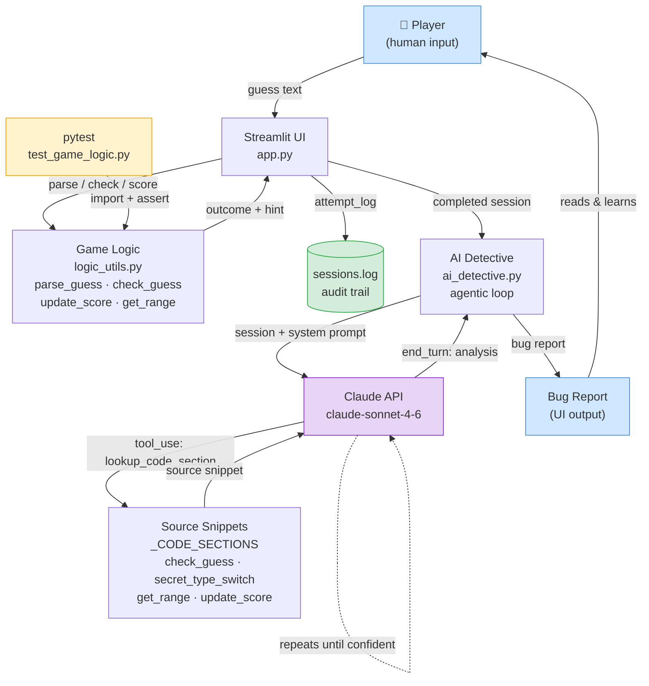

# System Architecture Diagram

Game Glitch Investigator — AI Bug Detective

## Component Descriptions

| Component | File | Role |
|-----------|------|------|
| Player | — | Provides guesses; reads the final bug report |
| Streamlit UI | `app.py` | Renders game, collects input, manages session state, triggers detective |
| Game Logic | `logic_utils.py` | Pure functions: parse, evaluate, score, range lookup (intentionally buggy) |
| Audit Trail | `sessions.log` | Append-only JSON log of every completed session |
| AI Detective | `ai_detective.py` | Drives the agentic tool-use loop with Claude |
| Claude API | `claude-sonnet-4-6` | Reasons over session data, calls tools, writes the bug report |
| Source Snippets | `_CODE_SECTIONS` in `ai_detective.py` | Named buggy code excerpts the model can request as evidence |
| Bug Report | Streamlit UI | Plain-language output the player reads in the browser |
| Test Suite | `tests/test_game_logic.py` | Imports `logic_utils` directly; asserts correct outcomes with pytest |

## Data Flow Summary

1. **Game loop** — Player guess → `logic_utils` evaluates → outcome + hint returned → attempt appended to session log.
2. **Agentic loop** — Completed session → `ai_detective` → Claude receives session + can call `lookup_code_section` N times → `end_turn` → bug report shown in UI.
3. **Testing** — `pytest` imports `logic_utils` independently of the UI and asserts outcomes.
4. **Human checkpoints** — Player judges whether the AI report matches their experience; a reviewer can cross-check the report against `sessions.log` and the source.
